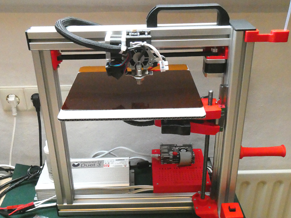

# Felix goes Duet 3

## Pimping up Felix printers with 32 bit, higher voltage and better stepper driver

### Felix 4.1 dual

I had problems accepting the long heating up times and the poor possibilities for manual interaction with the new Felix 4.1 firmware. So I tried to change this with a new [duet3](https://www.duet3d.com/) motherboard.

#### All infos on: <http://www.weigu.lu/microcontroller/felix4dual_duet3/index.html>

### Felix 3 single

I had so many spare parts from my old Felix 3. So I built a second printer with also higher voltage and the cool [duet3](https://www.duet3d.com/) motherboard.

#### All infos on: <http://www.weigu.lu/microcontroller/felix3single_duet3/index.html>
